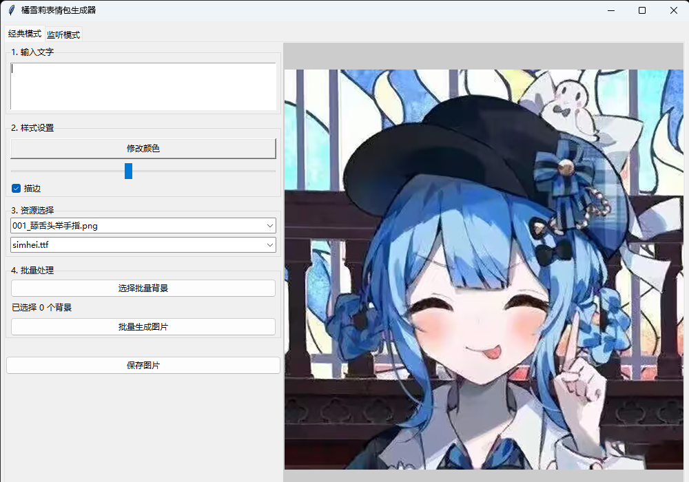
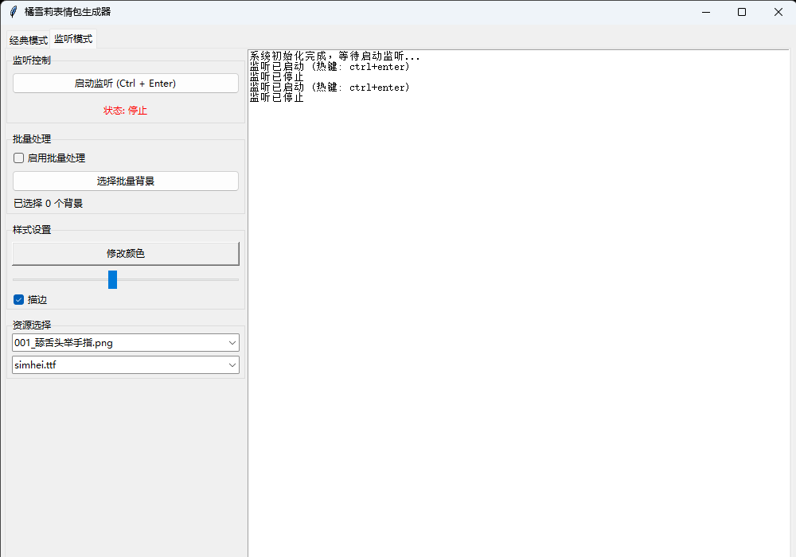

# 橘雪莉表情包生成器 (Sherry)

一个用于生成橘雪莉表情包的简单工具，基于Python和Tkinter图形界面开发。

## 更新内容
- 批量处理生成与监测模式下的批量轰炸
- 架构重构
- 监测热键更改为 Ctrl + Enter
  

## 使用方法

### Git Clone
从GitHub仓库克隆项目，我没记错的话叫 Tachibana-Sherry-Generator

### 安装依赖
```shell
cd Tachibana-Sherry-Generator
pip install -r requirements.txt
```

### 运行
```shell
python main.py
```

## 图示





## 架构
```text
Sherry/
├── main.py # [入口] 程序启动文件
├── requirements.txt # 依赖包
├── background_images/ # 背景图片
├── Font/ # 字体
├── images/ # 一些示例图片
| ├── 1.png
| ├── 2.png
├── core/
│ ├── __init__.py
| ├── config.py # [配置] 配置文件
│ └── generator.py # [核心] 图片生成逻辑 (原 generator.py)
|
├── services/
│ ├── __init__.py
│ ├── clipboard_mgr.py # [服务] 剪贴板管理 提供文本和图片的剪贴板操作(复制/粘贴/截图)
│ ├── keyboard_mgr.py # [服务] 键盘监听管理 用于监听Ctrl+Enter组合键
│ └── process_mgr.py # [服务] 进程检测管理 用于检测当前运行的应用程序
| 
└── ui/
├── __init__.py
├── app_window.py # [界面] 主窗口框架 (Notebook)
├── classic_tab.py # [界面] 经典模式选项卡
└── listener_tab.py # [界面] 监听模式选项卡

```
